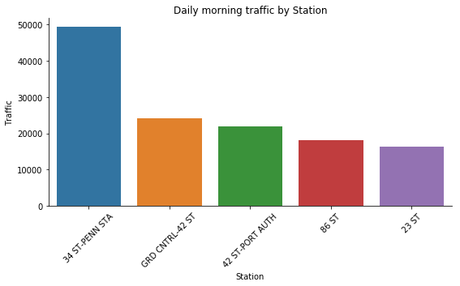
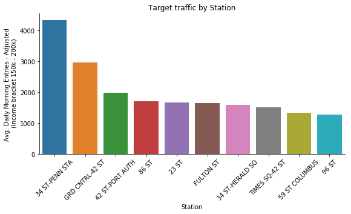

This is the first project in my Metis data science bootcamp in San Feancisco Summer 2018. 

### Background
WomenTechWomenYes (WTWY) has an annual gala at the beginning of the summer each year. The organization plans to place street teams at entrances to subway stations. The street teams collect email addresses and those who sign up are sent free tickets to the gala.  

We would like to use MTA subway data to ptimize the placement of our street teams, such that we can gather the most signatures, ideally from those who will attend the gala and contribute to our cause.

MTA subway data contains the number of entry/exit read from all turnstiles in MTA stations every few hours, and is published by NYC MTA on a weekly basis.
[MTA metadata](http://web.mta.info/developers/resources/nyct/turnstile/ts_Field_Description.txt)

### Analysis
The MTA data provides some insights about the subway traffic volume and distribution, but we need to know the population characteristics who are most likely to attend the event and make a donation. After performing some research, we found a paper published in 2015, by Yao, Kimberly ("Who gives? The determinants of charitable giving, volunteering, and their relationship."): 

> Current income, marital status, age, religion, and self-rank of social position were found to have significant effects on the frequency of charitable giving and volunteering.

Among the five predictors, current income has a particular strong positive correlation with donations. Therefore, we would like to go down this route to identify the population with higher income.  

The American Community Survey census data has a nice breakdown of household income by brackets by zip codes (), and we managed to merge census data with MTA data by retrieving the zip codes for all MTA stations with Googlemap Geocoder API.  

*A few considerations:  *
* We assumed the event would happen in early July 2018, thus we used MTA data from March to June 2018 to approximate the July data;
* Census data is based on residence addresses of surveyees, therefore we focused on entrance count in the morning as people are leaving their home to catch subway;
* There are a few income brackets according to census data. We focused on household income between 150k and 200k, as we assume people above 200k household income may not take subway.

### Results
We interpolated entry data at 6AM and 12PM for every turnstile reading and aggregated them by station and date. From there, morning traffic data is calculated by simply substracting the numbers.  

Here are the top 10 stations sorted by morning traffic:

This number is then mutiplied with the percentatge of people with household income between 150k and 200k in the same zip code, to derive the number of target population among the morning riders of the station. 

Here are the top 10 stations sorted by target population (traffic with household income bewteen 150k and 200k)

### Conclusion
### Recommendations
### Reflections
Through this project, I learnt what's required to not only survive, but to make the most of the bootcamp: 

1. Start early, as things move really fast
2. Ready to learn new techniques along the way
3. Collaborate with team members and learn from each other

