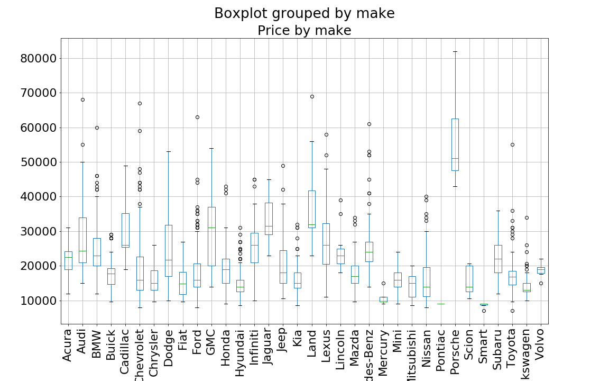
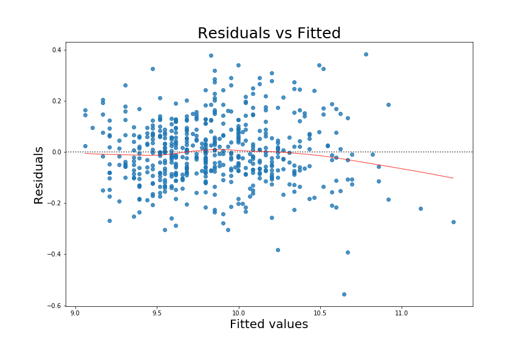
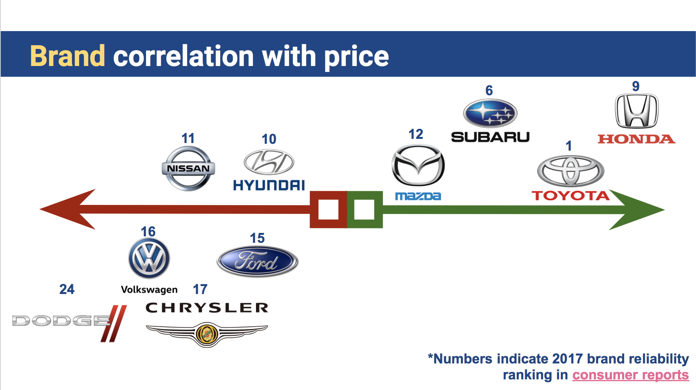
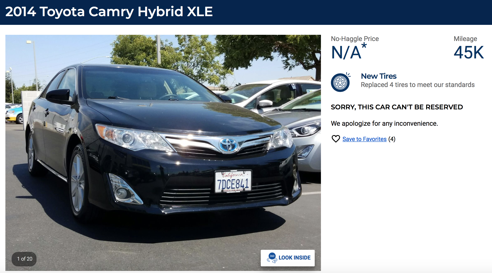

4 weeks ago, I moved out of campus to stay with my family. When the new quarter starts in September, I will have to drive 20 miles to school. Problem is, I don't have a car yet. In fact, I've never owned a car, nor do I know much about cars. Since I don't have much spare money to spend on a transporation tool, I decided to get a used car as my first car. 

*Carmax* is the largest retailer of used cars in United States. Their cars are verified to function well and sold with warranties, which is perfect for novice like me. Since I have no idea of the used car market and I am reviewing linear regression in Metis data science bootcamp, I decided to scrap some data from carmax.com and perform some analysis. Specifically, I would like to understand:
- What are the dominate features that determine the price?
- Which make is most perferred in the used car market?
- What is my negotiation baseline?
- How to get a good deal?

## Data Scraping 
Carmax has a systematic naming convention for URLs. Each car listing has its own URL uniquely labelled with stock id.(e.g. https://www.carmax.com/car/16170134). I am only interested in the car listings in my area, thus I limited my distance search criteria as 100 miles. There were around 2600 search results. I used Selenium & Python to identify and retrieve the individual listing URLs from the search result pages.

Once I get the list of 2600 car listing URLs, the scrape program visitied each page to capture the quantitative and qualitative informations. There were three categories of infomation I was interested in:
- Continuous variables: year, mileage, miles per gallon, number of previous owners, number of open recalls ..etc
- Binary variables: drive(2 wheel drive/4 wheel drive), Transmission(Automatic/Manual)
- Multi-categorical variables: store, make, model

There were some postings without price, excluding which I ended up with 2150 data points.

## Data Cleaning
When scraping, I captured as much data as possible, including stock id and VIN number..etc. While they are useful references to go back and check the original posting, they are not particularly useful in my analysis. Model is pretty useful, but there are too many categories and I don't have a lot of data points to fit it. Therefore, I dropped these three variables.

There were some missing values at random, like mileage, MPG, Engine, Horsepower. I tried to use MICE to impute the missing data but some values are imputed with negative numbers, which did not make sen se in this analysis (e.g. negative mileage). As the number is missing value is small, I decided to adopt a simple strategy and imputed them with categorical mean values.

The remaining two multi-categorical variabled were dummified, binary variables converted to 0 and 1, and continuous variables turned into float numbers.

## Exploratory Data Analysis
The used car prices, like price in other domains, are not normally distributed but positively skewed. As a standard practice, I have applied logarithmic transformation of the price to make it more normal.

When comparing the price among makes, it is clear that different makes have vastly different price ranges. Broadly speaking, the cars can be divided into three classes: luxury cars (Porsche, BMW..etc), Mid-range cars (Toyota, Ford..etc), Budget cars
(Mercury, Pontiac, Smart).

## Model building
After expanding the categorical variable into dummy variables and adding some polynomial and interactive terms, the number of variables increased drastically to over 100. In addition, I've added three categorical variables: luxury cars, budget cars, and mileage over 100k miles. Lasso regularization was applied to reduce the number of variables to 49 variables. 

Models were built based on training data and selected based on cross validation score (RMSE). The final model was evaluated against test data.

### Training RMSE: 0.14
### Test RMSE: 0.137
The score shows the predicted price is about +-14% different from the actual price.

Residual plot seems reasonabley random. 

## Observations
After reaching the final model, I came back to review my original questions.

- What are the dominate features that determine the price?

The top three variables that are positively correlated with price are: 
   **Category: Porsche** 
   **Category: Land** 
   **Binary: Luxury cars** 
  
The top three variables that are negatively correlated with price are: 
   **Category: Dodge** 
   **Binary: Budget cars** 
   **Binary: Manual cars** 

- Which make is most perferred in the used car market?

Excluding the luxury and budget cars, the midrange cars have different coefficients in the last model. Based on maginitude and sign of the coefficient, I've placed the make in the diagram below.

It seems Asian makes, especially the Japanese cars, are positively correlated with price. Not suprisingly, the [2017 consumer report](https://www.consumerreports.org/car-reliability-owner-satisfaction/car-brands-reliability-how-they-stack-up/) on car reliability survey, the ranking of these brands follow similar order (rank is marked as numbers in the pucture).

- What is my negotiation baseline?

With the final model, I am able to predict the price. This is especially useful, as there are a lot of postings on carmax website without price.

- How to get a good deal?

Comparing the predicted price with actual price, and I consider the postings that are under the prediction values as bargains. Specifically, I calculated the differences and reverse sorted the listings. As safety is my concern, I chose the number 1 make Toyota. Eventually, I browsed the top listings and find the following posting pretty attractive.
https://www.carmax.com/car/16058595

When the listing was scraped, the prices was $15998, which is a pretty good deal. **And it is a hybrid!**
